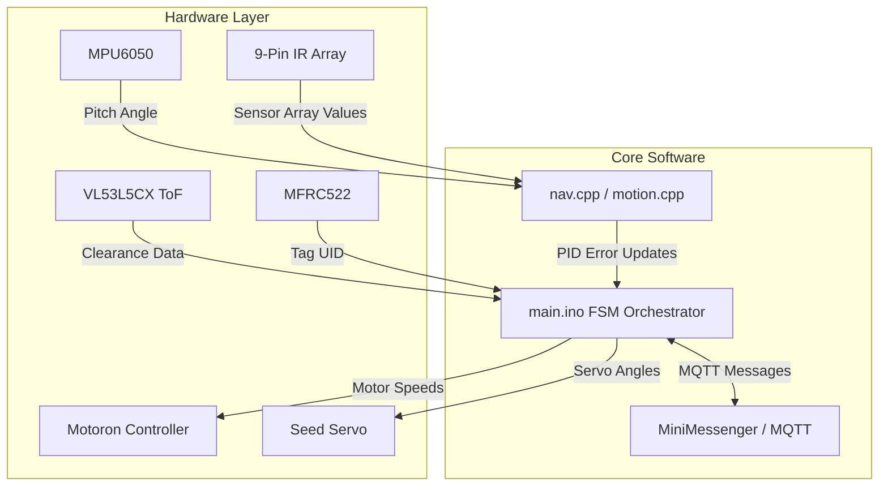
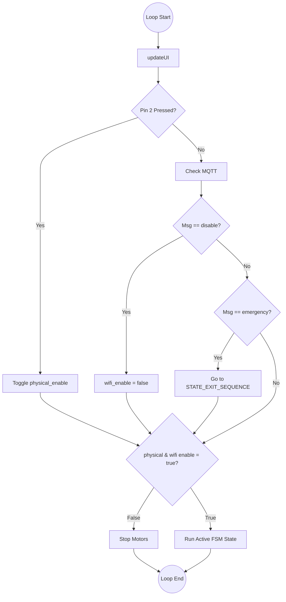
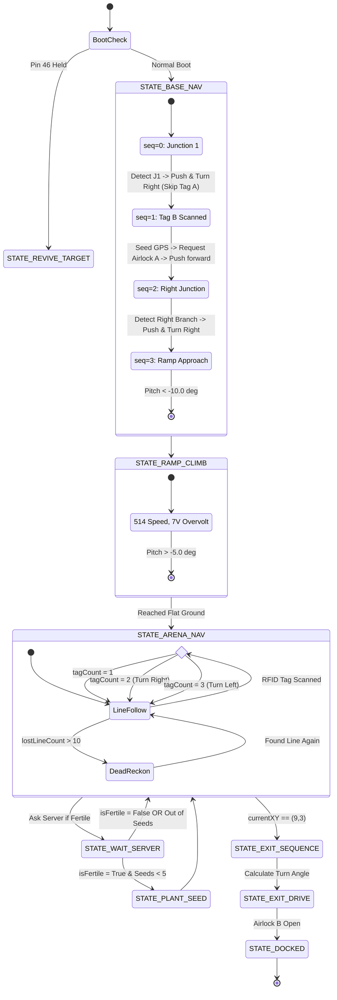
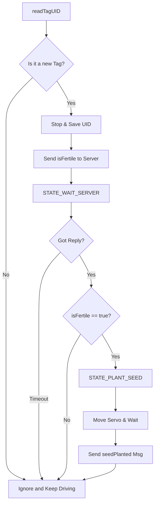

# COMP0204 Term 3 Robotics Challenge (2025-2026) 🤖
**Team Number:** 13
**Board ID:** Kayubo

Welcome to our Term 3 robotics project repository! This codebase contains our final firmware for the Trial #2 Checklist. 

For our navigation strategy, we quickly realized that just wandering around until the sensors hit a line wasn't going to work. The arena intersections all look exactly the same to the IR array. Instead, our robot uses a Finite State Machine (FSM) that counts the RFID tags and junctions as it passes them (`base_seq` and `arenaTagCount`). By keeping track of these "nodes", the robot basically knows its coordinates on the map and knows exactly when to turn or switch to dead-reckoning.

---

## 📂 Repository Structure
We separated our code into different files to keep the main loop clean and make it easier to debug specific parts of the hardware:

* `main.ino` - The main loop. It checks the network, handles the safety kill switches, and runs the main FSM.
* `config.h` - All our global variables, pin numbers, and PID/Motor speed limits.
* `motion.cpp / .h` - Handles the motor drivers, PWM voltage limits, and our IMU-assisted driving so it drives straight when off the line.
* `sensors.cpp / .h` - Reads the ToF sensor matrix and gets the pitch angle from the IMU.
* `nav.cpp / .h` - Holds the PID line follower logic and the wall-following code.
* `secrets.h` - (Not tracked in git) Contains our WiFi SSID/Passwords and MQTT IPs.
* `/docs` - Folder with Targets to attain, videos of robot's functions working and a report with evidence of sensor logging.
* `/tests` - Old scripts we used to unit-test each component by themselves before integrating them as well.

---

## 🛠️ Required Libraries & Hardware Setup
You'll need these libraries installed to compile our code:
* `Motoron` (Pololu Motoron M3S550 Shield) -> **I2C1**
* `Adafruit MPU6050` (IMU) -> **I2C1**
* `SparkFun VL53L5CX` (Time of Flight Imager) -> **I2C2**
* `MFRC522_I2C` (RFID Scanner) -> **I2C0**
* `Servo` -> **PWM**
* `MiniMessenger` -> **ESP32 WiFi Module**

### Hardware Wiring & Power Notes
* **Power:** We are using a 10.9V battery. To power the Arduino Giga R1 directly so the sensors don't lose power, we soldered a bridge between the `VM` and `AVIN` pins on the Motoron shield. 
* **Voltage Limits:** Our N20 motors are only rated for 6~7V. In `main.ino`, we cap the PWM at `440` (~6V) for normal driving, and bump it up to `514` (~7V) just for the ramp climb so we have enough torque.

---

## 🚀 How to Run It

1. Clone this repo.
2. Create a `secrets.h` file next to the `.ino` file and put in your WiFi and MQTT credentials.
3. Open `main.ino` in the Arduino IDE (Board: Arduino Giga R1 WiFi) and upload it.
4. **IMU Calibration:** **DO NOT TOUCH THE ROBOT FOR 3 SECONDS AFTER TURNING IT ON.** The MPU6050 takes 200 samples to figure out its zero-bias. If you bump it, the dead-reckoning will curve.
5. **Running the Tasks:**
   * **Tasks 1-6 (Base to Arena):** Turn it on normally. It starts in safe mode. Press the button on `Pin 2` to arm the motors.
   * **Tasks 7 & 8 (Rescue/Obstacle):** Hold down the **Revival Button (Pin 46)** while you power on the board. The code skips the whole base sequence and goes straight into the rescue mode.

---

## 🗺️ System Diagrams & Flowcharts

### 1. Software & Hardware Architecture
We tried to keep the hardware reading separate from the motor writing. The sensors feed data to the control algorithms, which figure out the errors and send them to the FSM. The FSM then tells the motors what to do.

### 2. Kill Switch & Emergency Handling
Safety is checked at the very start of the loop before any motor commands are allowed to run.

### 3. FSM Routing Sequence (Trial #2)
This shows our exact route through the map, including skipping the first base tag and counting the arena tags to do the 1.25m maneuvers.

### 4. RFID Scanning & Planting Logic

---

## 📊 Testing, Calibration & Bug Fixes
Getting the logic to match the physical real-world testing took a lot of trial and error. Here is what we calibrated and the main bugs we had to fix:

### Calibration
* **IR Sensor Thresholds:** We found that the ambient light in the lab read around ~400us on the floor and ~800us over the black tape. We set a hard cutoff at `500us` to filter out noise for our center-of-mass math.
* **PID Tuning:** We settled on `Kp = 20.0` and `Kd = 5.0` running at a base PWM of `440`. 
* **ToF Noise:** We had issues with the I2C bus getting overloaded when polling the ToF sensor too fast. We capped the ranging frequency to 60Hz and only read the middle horizontal band of pixels so a single bad reading wouldn't make the robot randomly stop.

### Major Bugs & How We Fixed Them
**1. The "Double Scan" Bug**
* **What happened:** Whenever the motors vibrated over an RFID tag, the tag would bounce slightly out of range of the antenna and back in. The MFRC522 reader thought it was a new tag and would scan it twice in a row. This completely messed up our `arenaTagCount` and made the robot execute its grid turns way too early.
* **The fix:** We added a string comparison check (`strcmp`). We save the UID of the last tag we scanned, and if the "new" tag matches the previous one, the code just returns `false` and ignores it.

**2. Turning Too Early (Kinematic Overshoot)**
* **What happened:** Because our IR array is mounted at the very front of the chassis, it detects the T-Junctions before the wheels actually reach the intersection. When we triggered an immediate 90-degree turn, the robot would pivot off-center and completely lose the track.
* **The fix:** We hardcoded a tiny blind push (`moveForwardTicks(300)`) right before any 90-degree turn. This pulls the wheel axis directly over the center of the line before it pivots.

**3. Open Field Panic (Task 4)**
* **What happened:** If the robot lost the line, our old code would make it spin in place to try and find it again. This meant the robot couldn't handle the Open Field task, because it would just get stuck spinning in circles in the empty space.
* **The fix:** We changed the logic so that if the line is completely lost for more than 10 frames (`lostLineCount > 10`), it totally ignores the PID loop and just pushes straight ahead (`moveStraightDeadReckoning`) using the IMU gyro to keep its heading until it finds the line on the other side.

---

## 🏆 Trial #2 Checklist
*This validates what our robot can actually do against the COMP0204 grading rubric.*

- [x] **1. Standard Line Tracking:** Smooth PID tracking using the 9-channel array.
- [x] **2. Intersection & Tag Alignment:** Navigates the base junctions, skips Tag A to save time, and stops over Tag B to request the airlock door.
- [x] **3. Solid Grid Navigation:** Executes the exact 1.25m topological maneuver (Node 2 Right -> Node 3 Left) by counting tags.
- [x] **4. Open-Field Dead Reckoning:** Bridges unlined gaps by using the IMU to drive perfectly straight when the line disappears.
- [x] **5. Ramped Incline/Decline Control:** Uses the pitch angle to detect the ramp (`< -10.0` degrees) and increases motor PWM to climb it without stalling.
- [x] **6. Wall Following:** Uses LiDAR distance to keep a 130mm offset from the walls inside the airlocks.
- [x] **7. Obstacle Detection and Avoidance:** ToF sensor detects blocks, stops the robot, and traces a box around the obstacle, returning to its exact original heading.
- [x] **8. Touch-Based Robot Revival:** Uses distance data to smoothly slow down as it gets closer (`map` function from 150mm to 35mm), softly bumps the stranded robot, and reverses back onto the line.
