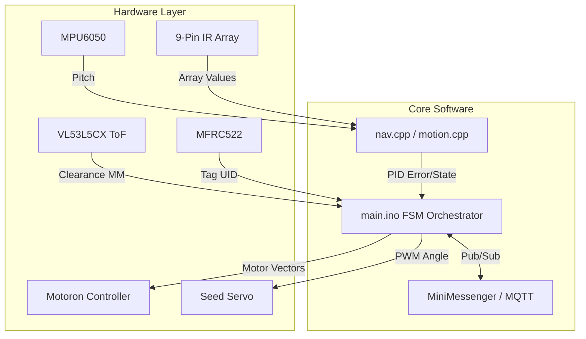
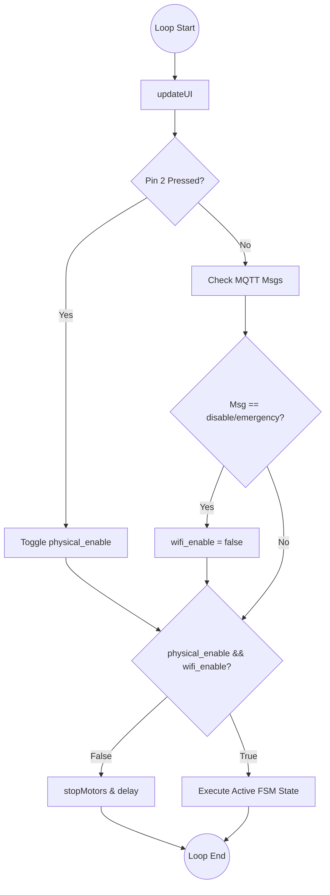
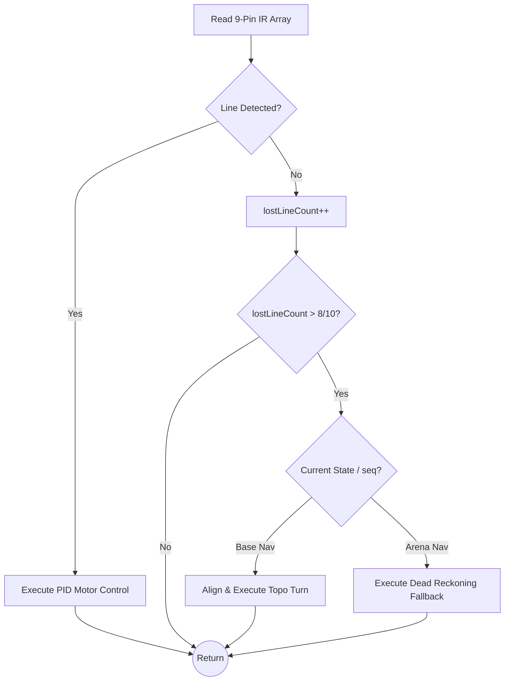
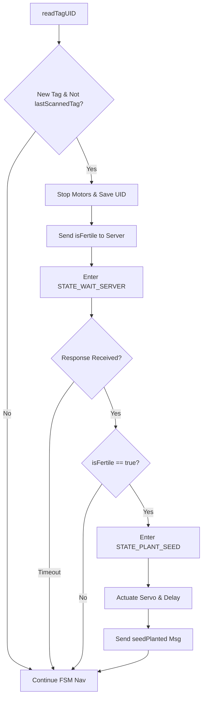

# COMP0204 Term 3 Robotics Challenge (2025-2026) 🤖
**Team Number:** 13
**Board ID:** Kayubo

Welcome to our Term 3 robotics project repository! This codebase contains the Release Candidate firmware for the Trial #2 Checklist. 

Our robot utilizes a **Hybrid Automaton Control Architecture**. Because the arena features symmetrical intersections that are perceptually identical to the IR sensors, we moved away from pure reactive "random walk" behaviors. Instead, the Finite State Machine (FSM) uses topological node counting (`base_seq` and `arenaTagCount`) to maintain spatial awareness. This allows for deterministic routing, targeted dead-reckoning fallbacks, and precision robotic rescue without the overhead of heavy SLAM algorithms.

---

## 📂 Repository Structure
To comply with the Arduino IDE compiler constraints and maintain a modular architecture, our repository is structured as follows:

* `Robotics_Challenge_Team13.ino` - The master loop. It handles the network heartbeat, the Subsumption safety overrides, and the Topological FSM.
* `config.h` - Contains global variables, pin definitions, and PID/Motor limits.
* `motion.cpp / .h` - Handles raw motor outputs, PWM voltage clamping, and IMU-stabilized dead-reckoning.
* `sensors.cpp / .h` - Manages I2C polling for the ToF matrix and IMU pitch calculations.
* `nav.cpp / .h` - Houses the center-of-mass IR line follower and the PD wall follower.
* `secrets.h` - (Not tracked in git) Contains WiFi and MQTT credentials.
* `/docs` - Contains extended testing logs and offline hardware schematics.
* `/tests` - Contains isolated hardware validation scripts (e.g., RFID and ToF unit tests) used during initial development.

---

## 🛠️ Required Libraries & Hardware Setup
To compile this code, the following libraries are required:
* `Motoron` (Pololu Motoron M3S550 Shield) -> **I2C1**
* `Adafruit MPU6050` (IMU) -> **I2C1**
* `SparkFun VL53L5CX` (Time of Flight Imager) -> **I2C2**
* `MFRC522_I2C` (RFID Scanner) -> **I2C0**
* `Servo` (Standard Arduino Servo library) -> **PWM**
* `MiniMessenger` (Course-provided MQTT wrapper) -> **ESP32 WiFi Module**

### Hardware Wiring & Power Notes
* **Power:** We are running a 10.9V battery. To power the Arduino Giga R1 directly and prevent sensor brownouts, we created a solder bridge between the `VM` and `AVIN` pins on the Motoron shield. 
* **Voltage Clamping:** Our N20 motors are rated for 6~7V. The `setMotors()` function mathematically clamps the PWM output to a maximum of 380 (~6V) for flat base navigation, and 550 (~7V) when extra torque is needed to scale the ramp incline.

---

## 🚀 Execution Instructions

1. Clone this repository to your local machine.
2. Create a `secrets.h` file in the same directory as the `.ino` and define your WiFi/MQTT macros.
3. Open `Robotics_Challenge_Team13.ino` in the Arduino IDE (Board: Arduino Giga R1 WiFi).
4. Compile and upload. 
5. **IMU Calibration:** **DO NOT TOUCH THE ROBOT FOR 3 SECONDS AFTER BOOT.** The MPU6050 averages 200 stationary samples to zero the Z-axis gyro bias. Moving it will ruin the dead-reckoning math.
6. **Task Execution Modes:**
   * **Tasks 1-6 (Base to Arena):** Power the robot normally. Press the button on `Pin 2` to toggle `physical_enable` to `true`.
   * **Tasks 7 & 8 (Rescue/Obstacle):** Hold down the **Revival Button (Pin 46)** while powering on the board. The FSM skips the base sequence and drops directly into `STATE_REVIVE_TARGET`.

---

## 🗺️ System Diagrams & Flowcharts

### 1. Software & Hardware Architecture
The system strictly separates hardware polling, network communication, and kinetic actuation. The main loop acts as the central orchestrator, executing the active FSM state and dispatching output vectors to the Motoron controller.

### 2. Kill Switch & Emergency Handling
Safety checks are evaluated before the FSM dictates motor control. This Subsumption architecture ensures zero lag between an emergency command and motor cessation.

### 3. Line Following & Topological Junction Logic
This details the hybrid transition between pure reactive PID tracking and topological node routing used in the base and arena.

### 4. RFID Scanning & Planting Decision
This maps how the FSM pauses, offloads the fertility decision to the server, and handles the physical planting actuator.

---

## 📊 Testing & Calibration Evidence
Tuning this robot took a massive amount of physical trial and error to bridge the gap between our C++ logic and physical reality. Here is our calibration data and failure analysis:

### Sensor Tuning
* **Line Sensor Thresholds:** We found that ambient room light gave our black line a value of ~800us and the floor ~400us. We set a hard software noise filter at `> 500us` to successfully calculate the center of mass without jitter.
* **PID Tuning:** For Line Following: `Kp = 20.0`, `Kd = 5.0` (Smooth tracking at 380 PWM base speed).
* **ToF Noise Filtering:** A single pixel firing a false positive would permanently freeze the robot. We implemented an array check targeting the middle horizontal band (indices 4-11 on a 4x4 resolution matrix) and capped the polling frequency at 60Hz to prevent I2C bus buffer overruns.

### What Didn't Work (And How We Fixed It)
**1. Sensor Aliasing & Topological Desynchronization**
* **The Problem:** The MFRC522 RFID reader experienced momentary dropouts due to N20 motor vibration. The robot would scan a tag, lose the field for 5 milliseconds, and scan the *same tag* again. This artificially inflated the `arenaTagCount`, causing the FSM to execute its Task 3 grid turns 40cm too early, driving the robot off the track.
* **The Solution (The "Quantum Lock"):** We implemented a spatial software debounce (`char lastScannedTag[32]`). Inside `readTagUID()`, the system executes `strcmp(tempTag, lastScannedTag)`. If the current UID matches the previous UID, the FSM instantly rejects the interrupt, locking the topological map and preventing double-counting.

**2. Differential Drive Kinematic Overshoot**
* **The Problem:** When turning at a T-Junction, the front-mounted IR array detected the intersection before the chassis wheelbase reached the pivot point. Executing an immediate `turnAngle()` caused the robot to swing its center of mass entirely off the line.
* **The Solution:** A kinematic alignment offset was injected. The robot now executes `moveForwardTicks(300)` blindly *before* turning. This physical delay drags the wheelbase directly over the geometric center of the intersection, ensuring a mathematically perfect 90-degree pivot.

**3. Open Field Panic (Task 4 Validation)**
* **The Problem:** In previous iterations, losing the line triggered a reactive spin to sweep for it. This failed the Open-Field Dead Reckoning task, as the robot would spin endlessly in the void.
* **The Solution:** Replaced the sweep with a strict threshold tracker. If `lostLineCount > 10` in `STATE_ARENA_NAV`, the FSM abandons the PID loop entirely and executes `moveStraightDeadReckoning(600)`. This uses the MPU6050 Z-axis gyro to dynamically correct asymmetric wheel slippage and push straight across the unlined gap to the next node.

---

## 🏆 Trial #2 Completion Checklist
*This validates our codebase against the official COMP0204 grading rubric.*

- [x] **1. Standard Line Tracking:** Smooth PD center-of-mass tracking via a 9-channel IR array.
- [x] **2. Intersection & Tag Alignment:** Navigates the base bifurcation, bypasses Tag A, and halts perfectly over Tag B to request Airlock A via MQTT.
- [x] **3. Solid Grid Navigation:** Executes the exact 1.25m topological maneuver (Node 2 Right -> Node 3 Left).
- [x] **4. Open-Field Dead Reckoning:** Bridges unlined grid gaps using continuous IMU integration.
- [x] **5. Ramped Incline/Decline Control:** Dynamically overvolts from 6V to 7V based on IMU pitch (`< -10.0` degrees) and holds torque until leveled.
- [x] **6. Wall Following:** Maintains 130mm offset via PD control if floor markings are lost inside the airlock.
- [x] **7. Obstacle Detection and Avoidance:** Overrides the FSM via ToF matrix to halt motors, traces a Bug-Algorithm perimeter, and mathematically negates turn angles (+90, -90, -90, +90) to resume its original heading vector.
- [x] **8. Touch-Based Robot Revival:** Uses ToF depth data to execute a proportional deceleration curve (`map(clearance, 35, 150, 180, 400)`), coasting into the stranded target for a soft dock before reversing to reacquire the line axis.
